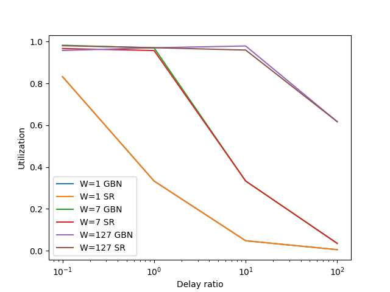
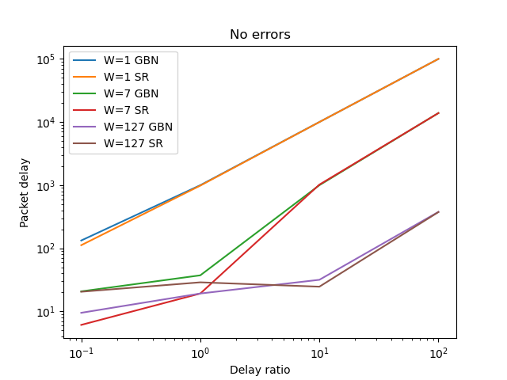
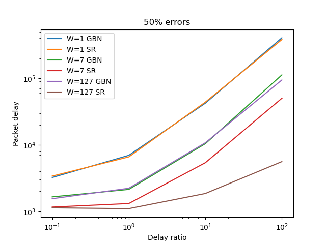

# Homework 2

> Yongun Seong 2017-19937

## Introduction

For this assignment, we implemented a simulator to produce performance metrics
in a variety of communication conditions. Furthermore, we performed various
tests using our simulator to better understand the effects of various parameters
on both packet delay and link utilization.

## Parameters

Our simulator allows modifying many parameters, as follows:

- `mode`: Choose between go-back-n and selective repeat.
- `sim_max`: The total number of packets to send in the simulator.
- `arrival_rate`: The packet arrival rate.
- `fwd_err_rate` and `bwd_err_rate`: The packet corruption and ack corruption
  rate, respectively.
- `trans_time`: The transfer delay for each packet.
- `prop_ratio`: The ratio between the transfer delay and the propagation delay.
- `timeout_ratio`: The ratio between the total round-trip and the timeout delay.

## Experiments

### Experiment 1: No errors, varying W and a

For the first experiment, we set all error rates to zero (0) and set a
sufficiently high packet arrival rate. Then, for each ARQ mode, we vary the
delay ratio and the window size, and measure the resulting utilization. The
results are summarized in Figure 1.

As expected, when both forward (packet) and backward (ack) error rates are zero,
the two schemes perform similarly. Clearly, these chemes differ only in the
presence of errors or timeouts. Furthermore, we observe the expected
relationship between the delay ratio and the window size.

### Experiment 2: Delay, and errors

In the second experiment, we performed a similar test to the first, with the
following changes: we set the forward and backward error rates to 0.5, and
measure the average packet delay. The results are shown in Figure 2 and Figure
3.

As in experiment 1, when we remove errors, both schemes perform equally. Even
when we introduce errors, there is little difference when the window size is
small, likely being limited by the very small window size. Once the window size
grows, however, it is clear that selective repeat performs far better than
go-back-n. This is as expected, as selective repeat makes better use of the
available link capacity by retransmitting only the required packets.

## Discussion

Through our experiments, we discovered various ways in which the input
parameters affect utilization and packet delay. Although we were unable to test
every combination due to time constraints, it is clear that selective repeat
performs equally or better compared to go-back-n in almost all cases. This is
likely affected by the fact that we are not measuring the overhead or the
complexity involved in a receiver-side buffer, among others.
